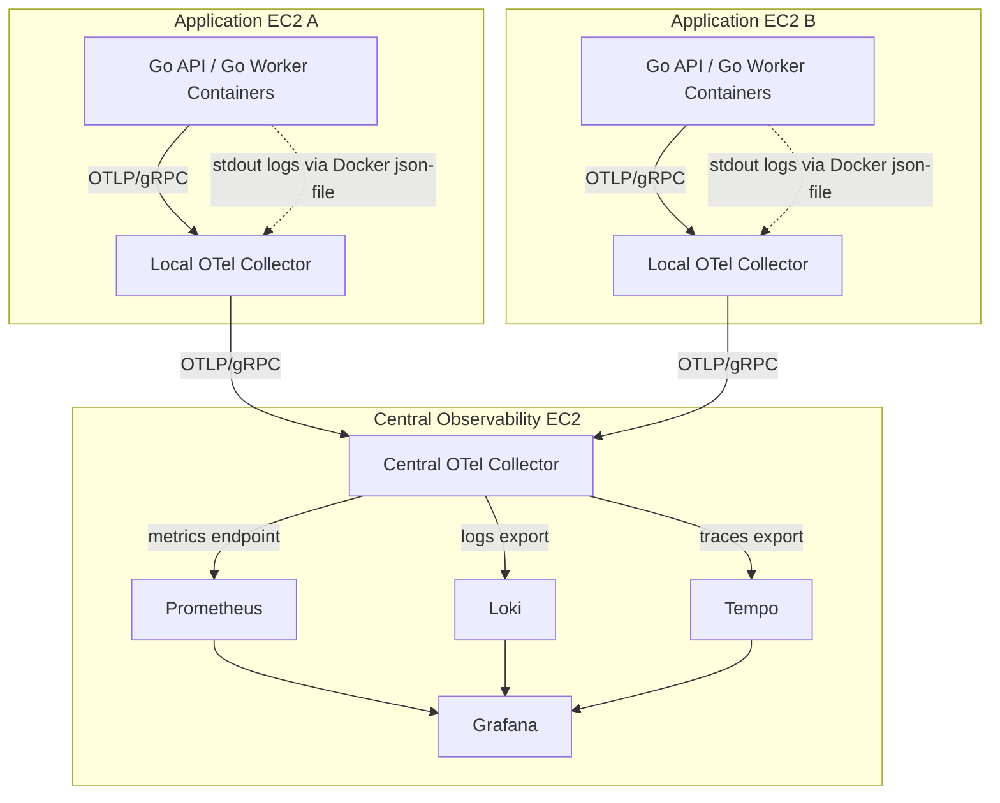
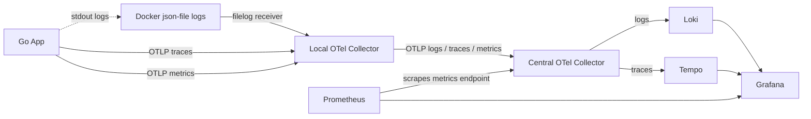
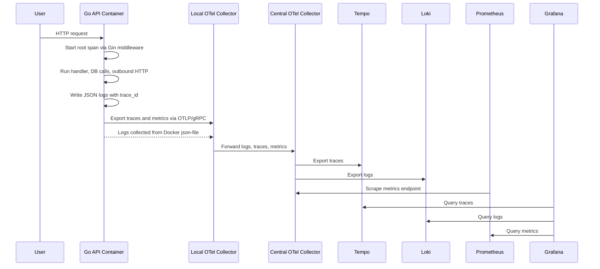
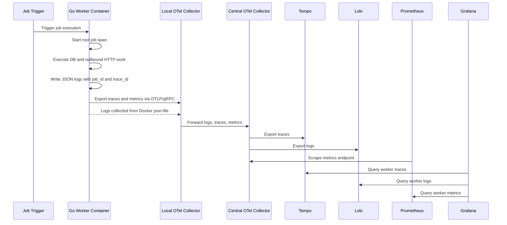

# Observability Architecture Overview

## 1. Purpose

This document describes the high-level observability architecture for our services, with the initial rollout focused on Go-based API and worker applications running on AWS EC2 with Docker Compose.

The goal is to provide a production-standard baseline for logs, metrics, and traces without introducing unnecessary operational complexity in the first phase.

This architecture is designed to:

- eliminate manual SSH-based log inspection
- provide end-to-end request and job tracing
- surface service health and performance through dashboards and alerts
- standardize observability across Go services
- create a platform that can later expand to non-Go services

## 2. Scope

### In Scope

- Go API services running in containers
- Go worker services running in containers
- OpenTelemetry-based traces and metrics
- centralized log aggregation
- dashboards in Grafana
- baseline alerting for critical failures

### Out of Scope for Initial Rollout

- Kubernetes support
- high availability for observability backends
- durable multi-hour local buffering during central outages
- first-class Laravel and Node.js instrumentation

## 3. High-Level Architecture

The architecture uses a two-tier model:

1. Application EC2 instances
2. Central observability EC2 instance

### 3.1 Topology Diagram

### Tier 1: Application EC2 Instances

Each application EC2 instance runs:

- one or more application containers
- one local OpenTelemetry Collector container

The local collector acts as the observability agent for that host. It is responsible for:

- receiving OTLP traces and metrics from local applications
- ingesting container logs from the Docker host
- enriching telemetry with resource metadata
- batching and forwarding telemetry to the central collector

### Tier 2: Central Observability EC2 Instance

The central observability EC2 instance runs:

- one central OpenTelemetry Collector
- Prometheus
- Loki
- Tempo
- Grafana

The central collector acts as the ingestion and routing layer for all telemetry coming from application hosts.

### 3.2 Signal Routing Diagram

## 4. Core Design Decisions

### 4.1 One Collector Per App Host

We use one local OpenTelemetry Collector per application EC2 instance instead of separate agents for logs, metrics, and traces.

This reduces:

- agent sprawl
- configuration duplication
- operational complexity

Why this decision:

- one agent per host is easier to deploy and debug than one agent per signal
- the collector already supports logs, metrics, and traces in one pipeline model
- teams only need one local telemetry destination for their applications
- this pattern matches common OpenTelemetry deployment guidance for VM or EC2-based workloads

### 4.2 OTLP as the Internal Standard

Applications send telemetry to the local collector over OTLP/gRPC.

Collectors communicate with each other using OTLP/gRPC.

This gives us:

- one standard telemetry protocol
- simpler application integration
- easier future evolution across services and languages

Why this decision:

- OTLP is the native OpenTelemetry transport and avoids signal-specific application exporters
- it reduces coupling between application code and backend storage systems
- changing storage backends later should not require application code changes
- Go services, future Node services, and future PHP integrations can all target the same collector contract

### 4.3 Centralized Storage and Visualization

The central observability node stores and visualizes all telemetry:

- Prometheus stores metrics
- Loki stores logs
- Tempo stores traces
- Grafana provides dashboards and correlation views

Why this decision:

- Prometheus, Loki, Tempo, and Grafana form a widely used open-source observability stack
- each backend is optimized for a specific signal type instead of forcing one system to do everything
- Grafana provides a single operator experience across all signals
- this keeps the storage model production-familiar while remaining cost-conscious for EC2 deployments

### 4.4 Prometheus Uses Scrape-Based Storage

Metrics should not be pushed into plain Prometheus using remote write as the primary design.

Instead:

- applications push OTLP metrics to the local collector
- local collectors forward metrics to the central collector
- the central collector exposes metrics in Prometheus format
- Prometheus scrapes the central collector

This keeps application-side integration simple while preserving a standard Prometheus storage model.

Why this decision:

- plain Prometheus is designed around scrape collection, not direct ingestion from applications
- scraping the central collector keeps storage aligned with standard Prometheus operations
- applications still get a push-style experience by emitting OTLP to their local collector
- this avoids introducing a misleading or partially supported remote-write design in the first rollout

### 4.5 Structured Logs to stdout

Applications should emit structured JSON logs to `stdout`.

Why this decision:

- container runtimes already treat `stdout` as the default logging surface
- JSON logs are easier to parse and index than plain text
- structured logs support reliable correlation fields such as `trace_id`, `span_id`, `service`, and `environment`
- this avoids separate application log file management inside containers

### 4.6 Docker `json-file` as a Controlled Pilot Constraint

For the initial rollout, Docker `json-file` is the required host log format for container log ingestion.

Why this decision:

- the current environment uses Docker Compose on EC2 rather than Kubernetes
- collector file-based ingestion is practical in this environment and avoids adding a second log shipper
- this is acceptable as a platform constraint for phase one
- it is treated as an implementation dependency, not as a permanent ideal logging architecture

### 4.7 Single Central Node for Phase One

The first rollout uses a single central EC2 instance for the observability stack.

Why this decision:

- it minimizes infrastructure overhead and speeds up adoption
- the first phase is validating telemetry correctness and developer usability, not high availability
- centralization simplifies troubleshooting while the stack is still new to the team
- the tradeoff is acceptable only if its single-point-of-failure status is explicit

## 5. High-Level Flow

### 5.1 Log Flow

1. Application writes structured JSON logs to `stdout`.
2. Docker stores container logs using the `json-file` log driver.
3. The local collector reads container log files from the host.
4. The local collector parses, batches, and enriches logs.
5. The local collector forwards logs to the central collector.
6. The central collector exports logs to Loki.
7. Grafana queries Loki for log search and correlation.

### 5.2 Trace Flow

1. Incoming API requests or worker jobs create spans in the Go application.
2. The Go service exports spans over OTLP/gRPC to the local collector.
3. The local collector batches and forwards traces to the central collector.
4. The central collector exports traces to Tempo.
5. Grafana queries Tempo to visualize traces.

### 5.3 Metrics Flow

1. The Go application emits OTLP metrics for golden signals and runtime health.
2. The local collector receives and batches those metrics.
3. The local collector forwards metrics to the central collector.
4. The central collector exposes metrics for Prometheus scraping.
5. Prometheus scrapes the central collector and stores the resulting time series.
6. Grafana queries Prometheus for dashboards and alerts.

## 6. Architecture Diagram in Words

The end-to-end path looks like this:

`Go API / Go Worker -> Local OTel Collector on same EC2 -> Central OTel Collector -> Loki / Tempo / Prometheus -> Grafana`

Broken down by signal:

- logs: `app stdout -> Docker json-file logs -> local collector -> central collector -> Loki -> Grafana`
- traces: `app -> local collector -> central collector -> Tempo -> Grafana`
- metrics: `app -> local collector -> central collector -> Prometheus scrape -> Grafana`

### 6.1 Request Lifecycle Diagram

### 6.2 Worker Lifecycle Diagram

## 7. Application-Side Observability Model

Applications should use a shared Go package for observability bootstrapping and conventions.

That package is responsible for:

- initializing OpenTelemetry providers
- configuring exporters
- registering service metadata
- wrapping logger usage so trace identifiers appear in logs
- instrumenting Gin handlers
- instrumenting PostgreSQL access
- instrumenting outbound HTTP calls
- creating job spans for worker flows

### Application Expectations

Each Go service should:

- emit structured JSON logs
- export traces and metrics to the local collector
- set consistent service and environment metadata
- avoid logging secrets
- keep custom metrics low-cardinality

## 8. Infrastructure Components

### 8.1 Local Collector

The local collector is the host-level telemetry agent.

Responsibilities:

- OTLP receiver for traces and metrics
- filelog receiver for container logs
- resource enrichment
- batching
- memory limiting
- retry and best-effort forwarding

Expected characteristics:

- lightweight
- stateless for the initial rollout
- one instance per app EC2

### 8.2 Central Collector

The central collector is the routing and normalization layer.

Responsibilities:

- receive OTLP from all local collectors
- fan out traces to Tempo
- fan out logs to Loki
- expose metrics for Prometheus scraping

### 8.3 Prometheus

Prometheus stores metrics for:

- request throughput
- request latency
- error rates
- worker performance
- service/runtime health

It also evaluates alert rules.

### 8.4 Loki

Loki stores application and infrastructure logs for:

- service debugging
- incident investigation
- correlation with traces

### 8.5 Tempo

Tempo stores distributed traces for:

- request path visualization
- latency investigation
- downstream dependency analysis

### 8.6 Grafana

Grafana is the primary user interface for operators and developers.

It provides:

- metrics dashboards
- log exploration
- trace search and visualization
- cross-signal correlation
- alert review

## 9. Deployment Model

### 9.1 Application Hosts

Each application host runs Docker Compose with:

- service containers
- one local OpenTelemetry Collector

For container-to-collector traffic inside Docker Compose, applications should target:

`otel-collector:4317`

Applications should not use `localhost:4317` unless the process is running directly on the host and not inside a container.

### 9.2 Central Host

The central observability host runs Docker Compose with:

- central OpenTelemetry Collector
- Prometheus
- Loki
- Tempo
- Grafana

### 9.3 Networking

Traffic should stay on private infrastructure paths wherever possible.

The main internal ports are:

- `4317` for OTLP/gRPC collector ingestion
- `9090` for Prometheus
- `3100` for Loki
- `3200` for Tempo
- `3000` for Grafana

Grafana should be authenticated and not left open publicly without access controls.

### 9.4 Network Boundary Reasoning

The preferred network model is:

- app containers communicate only with the local collector on the same host network or Compose network
- only local collectors communicate with the central collector
- backend services such as Loki, Tempo, and Prometheus are not directly called by application containers

Why this decision:

- it centralizes policy and backend knowledge inside collectors
- it reduces the number of network paths applications need to know about
- it limits accidental direct coupling between services and storage backends
- it makes future backend changes operational rather than application-level changes

## 10. Operational Standards

### 10.1 Logging Standard

Logs must be:

- JSON formatted
- written to `stdout`
- free of secrets and sensitive fields
- enriched with `trace_id` and `span_id` when available

### 10.2 Metrics Standard

Initial dashboards and alerts should focus on golden signals:

- latency
- traffic
- errors
- saturation

Custom metric labels must be kept low-cardinality.

### 10.3 Tracing Standard

Tracing should include:

- inbound HTTP requests
- outbound HTTP calls
- database operations
- worker job execution

Worker jobs should create a root span when no upstream trace context exists.

## 11. Resource Attribute Standard

All telemetry should consistently include:

- `service.name`
- `service.version`
- `deployment.environment`
- `host.name` or EC2 instance identifier
- stable container or compose service name where available

These fields are required for dashboard filtering, multi-service search, and trace-log correlation.

## 12. Pilot Limitations

The initial rollout intentionally accepts some constraints:

- the central observability node is a single point of failure
- local collectors use best-effort buffering rather than durable disk-backed queues
- only Go services are instrumented first
- Docker `json-file` is treated as a required logging constraint for host log ingestion

These are accepted for phase one to keep rollout manageable.

### 12.1 Tradeoff Summary

```mermaid
flowchart TD
    D1["One local collector per host"] --> B1["Benefit: simple deployment model"]
    D1 --> R1["Risk: collector becomes a key host dependency"]

    D2["Single central observability node"] --> B2["Benefit: fastest rollout"]
    D2 --> R2["Risk: single point of failure"]

    D3["Use OTLP everywhere"] --> B3["Benefit: standardized integration"]
    D3 --> R3["Risk: requires collector discipline"]

    D4["Docker json-file ingestion"] --> B4["Benefit: reuses current runtime behavior"]
    D4 --> R4["Risk: tied to Docker logging configuration"]

    D5["Prometheus scrape at center"] --> B5["Benefit: standard metrics storage"]
    D5 --> R5["Risk: requires central collector exposure"]

    D6["Best-effort local buffering"] --> B6["Benefit: lower rollout complexity"]
    D6 --> R6["Risk: telemetry can be lost during long outages"]
```

## 13. Architecture Rationale Summary

The overall design balances production standards with the realities of the current environment.

It is not the most highly available architecture, and it is not the most decoupled possible log ingestion model. It is, however, a practical architecture for EC2 plus Docker Compose that:

- uses the industry-standard open-source observability stack
- keeps application instrumentation consistent through OpenTelemetry
- avoids introducing multiple overlapping agents
- preserves a clean future path to better buffering and higher availability
- keeps the application contract stable even if the backend topology changes later

## 14. Future Evolution

After the pilot is proven, the architecture should evolve toward:

- durable local buffering during central outages
- stronger backup and retention controls
- improved central-node availability
- rollout to additional Go services
- extension to Laravel and Node.js services
- more complete alerting and runbooks

## 15. Success Criteria

The architecture should be considered successfully implemented when:

- a Go API emits logs, metrics, and traces visible in Grafana
- a Go worker emits logs, metrics, and traces visible in Grafana
- traces can be correlated to logs in Grafana
- Prometheus shows request rate, error rate, and latency
- Loki contains searchable structured logs by service and environment
- Tempo contains traces for API and worker activity
- service teams can adopt the integration without changing business logic

## 16. Grafana Dashboards

Grafana should start with four dashboards for the pilot:

- Service Overview
- Worker Overview
- Observability Platform Health
- Logs and Traces Drilldown

These dashboards should focus on golden signals, platform health, and cross-signal debugging rather than large amounts of low-value operational noise.

The detailed panel-by-panel dashboard specification lives in:

- `observability-infra/docs/grafana-dashboard-spec.md`

At a high level, Grafana should include:

- request rate, error rate, and latency for API services
- job throughput, failure rate, and duration for worker services
- collector health, dropped telemetry, and central node resource usage
- logs by service and severity with trace-to-log correlation

## 17. Application Integration Guidance

The architecture assumes a generic containerized Go Gin application as the first-class integration target.

That integration is documented from two sides:

- package-side integration guide: `go-observability/docs/gin-integration-guide.md`
- platform-side integration contract: `observability-infra/docs/application-integration-contract.md`

Together, those documents define:

- required environment variables
- collector endpoint expectations by deployment shape
- Gin middleware expectations
- Zap-compatible structured logging expectations
- GORM instrumentation expectations
- outbound HTTP instrumentation expectations
- worker instrumentation expectations
- validation criteria for logs, traces, and metrics

## 18. Recommended Next Documents

This overview should be followed by more specific documents:

- shared Go package design
- generic Go Gin integration guide
- local collector configuration specification
- central collector and storage stack specification
- application integration contract
- Grafana dashboard specification
- Grafana dashboards and alerting specification
- rollout and operations runbook
