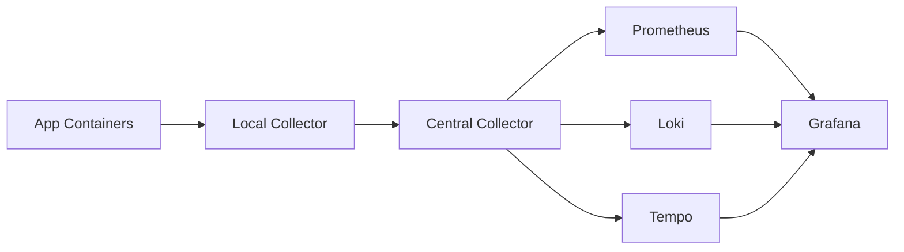

# Component Deep Dive

## Purpose

This document explains each major component in `observability-infra` at a deeper operational level:

- what it does
- how it is configured
- what its config is trying to achieve
- what it exposes
- what can fail

This document is organized by component, not by signal.

## Local Collector

Config:

- [collector/local/config.yaml](/home/jainam/repository/observability-infra/collector/local/config.yaml)

Deployment:

- [deploy/local/docker-compose.yml](/home/jainam/repository/observability-infra/deploy/local/docker-compose.yml)

### What it does

The local collector is the host agent.

It receives:

- OTLP traces and metrics from app containers
- Docker container logs from `/var/lib/docker/containers`
- app file logs from `/var/telemetry-logs`

It then:

- parses logs
- promotes selected fields into resource attributes
- adds host metadata
- batches telemetry
- forwards everything to the central collector

### Why there are two `filelog` receivers

There are two distinct log sources:

- `filelog`
  reads Docker `json-file` logs

- `filelog/app`
  reads structured application log files

This is useful because app file logs are often cleaner and easier to enrich, while Docker logs remain a generic fallback path.

### Why the `resource` processor exists

The local collector adds:

- `host.name`
- `host.id`
- `cloud.provider`

This makes telemetry queryable by host context later without making the app emit host metadata itself.

### Why log batch settings are separate

The local collector uses:

- `batch/default`
- `batch/logs`

Logs are flushed faster than metrics and traces.

That is intentional:

- logs are often used for immediate incident debugging
- trace and metric batching can tolerate more delay

## Central Collector

Config:

- [collector/central/config.yaml](/home/jainam/repository/observability-infra/collector/central/config.yaml)

Deployment:

- [deploy/central/docker-compose.yml](/home/jainam/repository/observability-infra/deploy/central/docker-compose.yml)

### What it does

The central collector is not a store.
It is a router and protocol bridge.

It:

- receives OTLP from local collectors
- exports traces to Tempo
- exports logs to Loki
- exposes metrics to Prometheus

### Why metrics go to Prometheus differently

The central collector does not push metrics into Prometheus.
It exposes them on `:8889`.
Prometheus scrapes them.

That keeps Prometheus in its normal operational model.

### Why there are Loki-specific processors

The central collector includes:

- `attributes/loki`
- `resource/loki`

These processors declare which fields should become Loki labels.

That is how fields like:

- `service.name`
- `deployment.environment.name`
- `level`

become queryable as Loki labels.

Without this step, log search in Grafana would be much weaker.

## Prometheus

Config:

- [prometheus/prometheus.yml](/home/jainam/repository/observability-infra/prometheus/prometheus.yml)
- [prometheus/alert-rules.yml](/home/jainam/repository/observability-infra/prometheus/alert-rules.yml)

### What it scrapes

Current scrape jobs:

- `central-otel-collector`
- `central-otel-collector-self`
- `prometheus`

This means:

- application telemetry arrives through the central collector scrape endpoint
- internal central collector self-metrics are also available
- Prometheus itself is self-observed

### Why the alert set is small

The current rules focus on:

- central collector down
- Prometheus down
- high HTTP 5xx rate
- high HTTP p95 latency

This is the correct early-stage approach because alerting should start narrow and reliable before it grows broader.

## Loki

Config:

- [loki/config.yaml](/home/jainam/repository/observability-infra/loki/config.yaml)

### Storage model

This Loki setup is:

- single-node
- filesystem-backed
- TSDB schema based
- auth disabled on the internal network

This is not an HA design.
It is a pilot-friendly but production-familiar baseline.

### Why `allow_structured_metadata` is enabled

This allows Loki to keep structured metadata richer than plain line storage alone.

That aligns well with JSON logs and Grafana exploration workflows.

## Tempo

Config:

- [tempo/config.yaml](/home/jainam/repository/observability-infra/tempo/config.yaml)

### Storage model

This Tempo setup is:

- single-node
- local filesystem-backed
- WAL enabled
- retention managed by the compactor

### Why Tempo is pinned to `2.9.1`

The repository deliberately uses `grafana/tempo:2.9.1` because newer defaults in `2.10.x` introduce Kafka-oriented ingest assumptions that do not fit this simple local-storage single-binary deployment.

That pin is a stability decision, not an arbitrary version freeze.

### Why `max_block_duration` matters

Tempo ingests traces into blocks.

`ingester.max_block_duration: 5m` affects how quickly traces move into persisted searchable blocks.

That matters because:

- recent traces may behave differently from older flushed blocks
- search and autocomplete behavior can feel inconsistent if you do not understand this timing

## Grafana

Provisioning:

- [grafana/provisioning/datasources/datasources.yml](/home/jainam/repository/observability-infra/grafana/provisioning/datasources/datasources.yml)

Dashboards:

- [grafana/dashboards/service-overview.json](/home/jainam/repository/observability-infra/grafana/dashboards/service-overview.json)
- [grafana/dashboards/worker-overview.json](/home/jainam/repository/observability-infra/grafana/dashboards/worker-overview.json)
- [grafana/dashboards/logs-and-traces-drilldown.json](/home/jainam/repository/observability-infra/grafana/dashboards/logs-and-traces-drilldown.json)

### Data source model

Grafana has three provisioned data sources:

- Prometheus
- Loki
- Tempo

Prometheus is the default source.

### Tempo to Loki correlation

Tempo is provisioned with a `tracesToLogsV2` block that tells Grafana how to pivot from a trace to logs.

The current custom query is:

```text
{service_name="$${__span.tags.service.name}"} |= "$${__trace.traceId}"
```

That is why consistent `service_name` labels and `trace_id` in logs matter.

### Loki derived fields

The Loki data source extracts `TraceID` using:

```text
"trace_id":"([a-fA-F0-9]+)"
```

That gives Grafana a structured pivot from logs back into Tempo.

## Deployment Layer

There are two compose entry points:

- [deploy/central/docker-compose.yml](/home/jainam/repository/observability-infra/deploy/central/docker-compose.yml)
- [deploy/local/docker-compose.yml](/home/jainam/repository/observability-infra/deploy/local/docker-compose.yml)

### Why deployment wrappers are separate from collector configs

This separation is intentional:

- collector config files define behavior
- compose files define runtime shape

That makes it easier to:

- reason about the collector logic separately
- reuse configs in other deployment wrappers later
- keep the architecture modular

## Component Relationship Diagram



## Common Failure Interpretation

### Grafana shows no fresh data anywhere

Likely causes:

- local collector down
- central collector down
- app stopped sending telemetry

### Logs work but traces do not

Likely causes:

- Tempo down
- central collector trace export issue
- app trace export disabled

### Metrics work but dashboards look empty for one service

Likely causes:

- label mismatch such as wrong `service.name`
- wrong environment filter
- route or job-name dimensions missing in emitted metrics

### Trace search works but Tempo selectors are empty

Likely causes:

- tag lookup window too small
- not enough recent indexed traces for autocomplete

That is why the repository sets `timeRangeForTags: 86400`.

