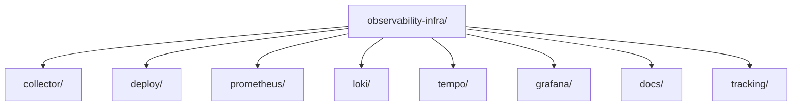

# Repository Structure Guide

## Purpose

This document explains how `observability-infra` is laid out and how to reason about the code and configuration structure.

The main rule is:

- behavior is separated by concern
- runtime shape is separated from component config
- documentation is separated from implementation assets

## Repository Map

## `collector/`

Purpose:

- collector behavior only

Subdirectories:

- `collector/local/`
- `collector/central/`

What belongs here:

- collector pipeline configs
- collector env examples
- collector-specific readmes

What does not belong here:

- Docker Compose wrappers
- Grafana dashboards
- backend storage configs

## `deploy/`

Purpose:

- runtime wrappers only

Subdirectories:

- `deploy/local/`
- `deploy/central/`

What belongs here:

- Docker Compose files
- deploy-time `.env.example`
- deployment readmes

Why this separation matters:

- compose files describe how services run
- they should not contain the full operational meaning of each component
- that meaning belongs in component configs and docs

## `prometheus/`

Purpose:

- Prometheus scrape and alerting config

Files:

- `prometheus.yml`
- `alert-rules.yml`

This folder is the metrics storage and alerting contract.

## `loki/`

Purpose:

- Loki storage config

Files:

- `config.yaml`

This folder exists so log storage decisions remain explicit and reviewable.

## `tempo/`

Purpose:

- Tempo trace storage and search config

Files:

- `config.yaml`

This folder is where trace retention, block timing, and receiver configuration live.

## `grafana/`

Purpose:

- Grafana provisioning and dashboard definitions

Subdirectories:

- `grafana/provisioning/`
- `grafana/dashboards/`

### `grafana/provisioning/`

Contains data source and provisioning assets.

This is where Grafana is told:

- which backends exist
- how Tempo-to-Loki correlation works
- how dashboards are loaded

### `grafana/dashboards/`

Contains version-controlled dashboard JSON.

This is where operator UX is codified.

## `docs/`

Purpose:

- architecture
- operational guidance
- design reasoning
- rollout guidance

This folder should answer why the repository exists in this form, not just what each file does.

## `tracking/`

Purpose:

- implementation execution tracking

Files:

- `implementation-checklist.csv`

This is not runtime configuration.
It is delivery and verification tracking.

## How To Safely Change The System

### If you want to change collector behavior

Start in:

- `collector/local/config.yaml`
- `collector/central/config.yaml`

Then validate whether the deploy env examples need updates.

### If you want to change container runtime shape

Start in:

- `deploy/local/docker-compose.yml`
- `deploy/central/docker-compose.yml`

Then validate whether:

- mounted files still exist
- exposed ports still make sense
- env examples still match

### If you want to change metric behavior

Start in:

- `prometheus/prometheus.yml`
- `prometheus/alert-rules.yml`

### If you want to change log storage behavior

Start in:

- `loki/config.yaml`
- `collector/central/config.yaml`

because Loki storage behavior and central collector label/export behavior both matter.

### If you want to change trace behavior

Start in:

- `tempo/config.yaml`
- `collector/central/config.yaml`
- `grafana/provisioning/datasources/datasources.yml`

because trace ingestion, storage, and Grafana query behavior are spread across those files.

### If you want to change dashboard UX

Start in:

- `grafana/dashboards/*.json`

and verify whether Grafana provisioning or data source assumptions also need to change.

## How To Read The Repository In Practice

Use this order when learning the system:

1. `README.md`
2. [system-guidebook.md](system-guidebook.md)
3. `deploy/central/docker-compose.yml`
4. `deploy/local/docker-compose.yml`
5. `collector/local/config.yaml`
6. `collector/central/config.yaml`
7. `grafana/provisioning/datasources/datasources.yml`
8. backend configs under `prometheus/`, `loki/`, and `tempo/`
9. dashboard JSON files

That order matches the architectural layering:

- deployment shape
- ingestion path
- routing path
- storage path
- operator UX
