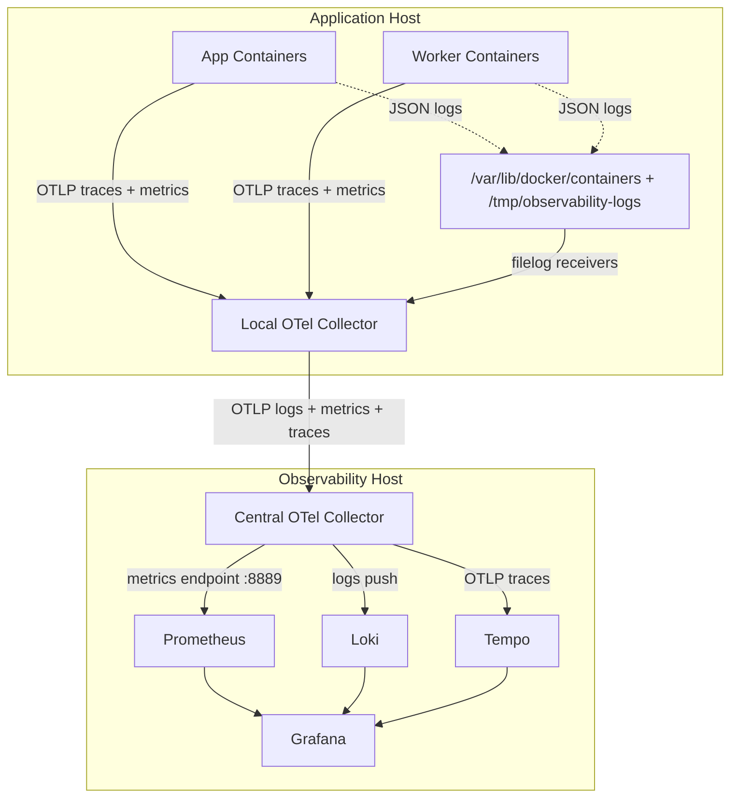
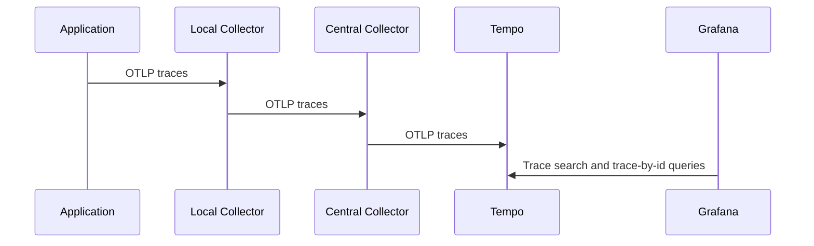
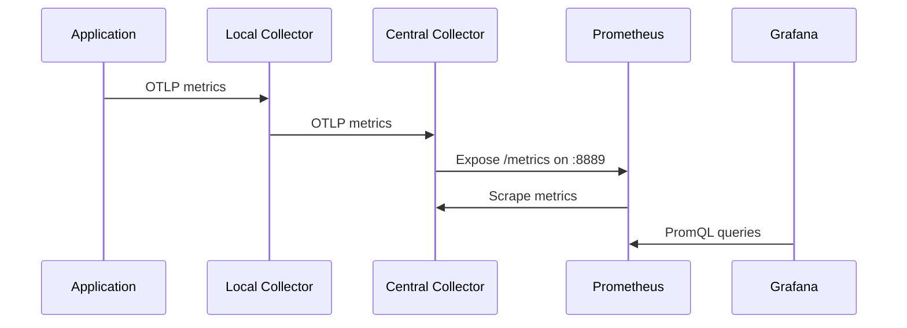
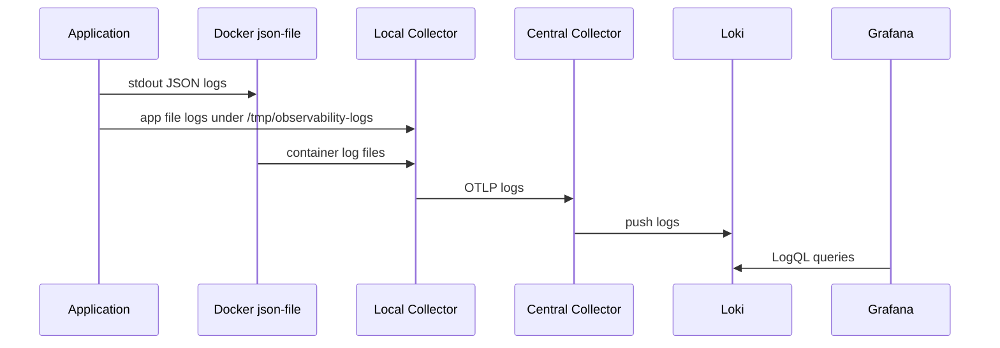

# System Guidebook

## Purpose

This document explains the full `observability-infra` system as it exists today.

It is meant to answer:

- what the system is
- why it is designed this way
- what each layer does
- how the signals flow
- why specific ports are exposed
- how Grafana queries work
- where the design is intentionally simple and where it is intentionally opinionated

This is the architecture-level guide. For file-by-file detail, use:

- [component-deep-dive.md](/home/jainam/repository/observability-infra/docs/component-deep-dive.md)
- [repository-structure-guide.md](/home/jainam/repository/observability-infra/docs/repository-structure-guide.md)

## System In One Sentence

Application containers emit telemetry to a local collector on the same host, the local collector forwards telemetry to a central collector, and the central collector routes each signal to the right backend so Grafana can query everything from one UI.

## Why The System Has Two Collectors

The most important architectural decision in this repository is the two-tier collector model:

- one local collector per application host
- one central collector on the observability host

This is deliberate.

### Why not send applications directly to Loki, Tempo, and Prometheus?

Because that would force every application deployment to know too much about storage backends.

If applications had to talk directly to all backends:

- app configs would become backend-specific
- backend migrations would be painful
- log shipping would need a separate path from traces and metrics
- every service would need more operational knowledge than it should have

### Why the local collector exists

The local collector solves host-local concerns:

- it gives all app containers one OTLP endpoint
- it can read host-visible Docker logs and app file logs
- it enriches telemetry with host metadata
- it keeps noisy, per-host ingestion logic off the central node

### Why the central collector exists

The central collector solves backend-routing concerns:

- it receives one normalized OTLP stream from local collectors
- it exports logs to Loki
- it exports traces to Tempo
- it exposes metrics for Prometheus scraping

This separation keeps the application side simple and keeps backend wiring centralized.

## Current Runtime Model

The current repository supports a single-node central observability stack and one local collector per application host.

That means:

- Grafana, Tempo, Loki, Prometheus, and the central collector run together on one host
- each application host runs one local collector
- app containers do not need to share a Docker network with the central stack

## Architecture Diagram

## Signal Flow

There are three independent signal paths that share the same collector topology.

## Trace Flow

### Trace design intent

- the app emits spans only to the local collector
- the local collector does not store traces
- the central collector does not store traces
- Tempo is the trace store of record
- Grafana is only the trace query UI

### Why this is useful

It keeps the app contract stable:

- app speaks OTLP
- collector topology can evolve later
- Tempo can be replaced later without re-instrumenting the apps

## Metric Flow

### Metric design intent

Prometheus is scrape-based in this system.

The app does not push directly to Prometheus.
The app emits OTLP metrics.
The central collector translates them into a Prometheus scrape surface.

### Why this is useful

- Prometheus remains the metrics store of record
- the app still uses OpenTelemetry, not a Prometheus-specific client
- the central collector is the normalization point

## Log Flow

### Why the log path is different

Unlike traces and metrics, logs are not emitted by the app over OTLP in this setup.

The local collector reads:

- Docker `json-file` logs from `/var/lib/docker/containers`
- structured app file logs from `/tmp/observability-logs`

This is intentional because:

- it keeps application logging simple
- it supports generic container workloads
- it allows app JSON fields like `service` and `deployment_environment` to be promoted into resource metadata

## Why Specific Ports Are Exposed

The port exposure is driven by operator access and inter-component contracts.

### Local collector exposed ports

- `14317 -> 4317`
  Why: app containers in separate Docker Compose projects can send OTLP gRPC to the host-local collector.

- `14318 -> 4318`
  Why: optional OTLP HTTP intake for clients that do not use gRPC.

- `11333 -> 13133`
  Why: health check endpoint for the local collector.

### Central collector exposed ports

- `4317`
  Why: local collectors forward OTLP to the central collector over gRPC.

- `4318`
  Why: optional OTLP HTTP ingress.

- `8889`
  Why: Prometheus scrapes metrics exposed by the central collector.

- `13133`
  Why: health check endpoint for the central collector.

### Backend exposed ports

- `9090`
  Why: direct Prometheus access and debugging.

- `3100`
  Why: Loki API access for Grafana and debugging.

- `3200`
  Why: Tempo search and trace APIs for Grafana and debugging.

- `3300 -> 3000`
  Why: user-facing Grafana UI is intentionally host-exposed on `3300` to avoid conflicting with anything already using `3000`.

## Current Backend Responsibilities

### Prometheus

Prometheus stores metrics and evaluates alert rules.

It is the answer to:

- what is the request rate
- what is the error rate
- what is the latency
- what are the worker counters and DB metrics

It is not responsible for logs or traces.

### Loki

Loki stores logs and serves LogQL queries.

It is the answer to:

- what happened recently
- what services are producing logs
- which logs contain errors
- which logs carry trace IDs

### Tempo

Tempo stores traces and supports search and trace-by-id queries.

It is the answer to:

- what did a request or job do internally
- which spans belong to that flow
- what child DB or downstream calls happened

### Grafana

Grafana is only the UI and correlation layer.

It is the answer to:

- how operators view the system
- how dashboards, logs, and traces are explored
- how Tempo-to-Loki correlation is presented

Grafana does not store telemetry.

## Grafana Data Source Model

Grafana talks to three backends:

- Prometheus for metrics
- Loki for logs
- Tempo for traces

The current provisioning also includes:

- Loki derived field extraction for `trace_id`
- Tempo trace-to-logs pivoting into Loki
- Tempo `timeRangeForTags: 86400` to make tag autocomplete usable in bursty local environments

## Why Tempo Uses `timeRangeForTags`

Tempo trace search results and Tempo autocomplete do not use the same lookup path.

- the trace result table uses the selected query range
- the selector autocomplete uses the datasource's `timeRangeForTags`

This matters because the table can show traces while the dropdowns still look empty if tag lookup is constrained too tightly.

The repository sets:

- `timeRangeForTags: 86400`

because this gives a more useful operator experience in a local or low-volume environment without changing the trace storage model.

## How Labels And Attributes Become Queryable

The label story is one of the most important parts of the system.

### On the application side

The app emits structured JSON logs with fields like:

- `service`
- `deployment_environment`
- `level`
- `trace_id`

The app also emits traces and metrics with OpenTelemetry resource attributes like:

- `service.name`
- `deployment.environment.name`

### On the local collector side

The local collector promotes selected log fields into resource attributes:

- `attributes.service` -> `resource["service.name"]`
- `attributes.deployment_environment` -> `resource["deployment.environment.name"]`

It also stamps host metadata:

- `host.name`
- `host.id`
- `cloud.provider`

### On the central collector side

The central collector tells Loki which resource attributes should become Loki labels:

- `service.name`
- `deployment.environment.name`

and which log attributes should become Loki labels:

- `level`

This is why Grafana log queries work with labels like:

- `service_name`
- `deployment_environment_name`
- `level`

## Why The System Avoids Direct Backend Semantics In Apps

The design goal is to keep the app contract OpenTelemetry-native.

That means:

- apps should not care about Prometheus scrape config
- apps should not care about Loki push APIs
- apps should not care about Tempo ingestion config

The only thing the app should know is:

- where the local collector is
- what service and environment metadata it should emit

That keeps the migration path open.

## Failure Domains

Understanding failure domains makes the design easier to operate.

### If an app is broken

- only that service's telemetry is affected
- the local collector can still be healthy
- the central stack can still be healthy

### If a local collector is broken

- telemetry from that host stops moving upstream
- other hosts remain unaffected
- the central stack can still be healthy

### If the central collector is broken

- all upstream telemetry ingestion is blocked
- Prometheus, Loki, Tempo, and Grafana may still be running but will stop receiving fresh data

### If a backend is broken

- only that signal becomes unavailable
- for example:
  - Loki down means log queries fail
  - Tempo down means trace queries fail
  - Prometheus down means metric queries and alerts fail

## Current Design Tradeoffs

This stack is intentionally practical, not maximal.

### What it optimizes for

- simple deployment
- readable configs
- stable app integration contract
- good local and pilot usability
- clear separation between app instrumentation and platform routing

### What it does not optimize for yet

- high availability
- long local buffering during central outages
- multi-region operation
- infinite retention
- Kubernetes-native deployment

## What To Read Next

- [component-deep-dive.md](/home/jainam/repository/observability-infra/docs/component-deep-dive.md)
- [repository-structure-guide.md](/home/jainam/repository/observability-infra/docs/repository-structure-guide.md)
- [deployment-validation-runbook.md](/home/jainam/repository/observability-infra/docs/deployment-validation-runbook.md)

